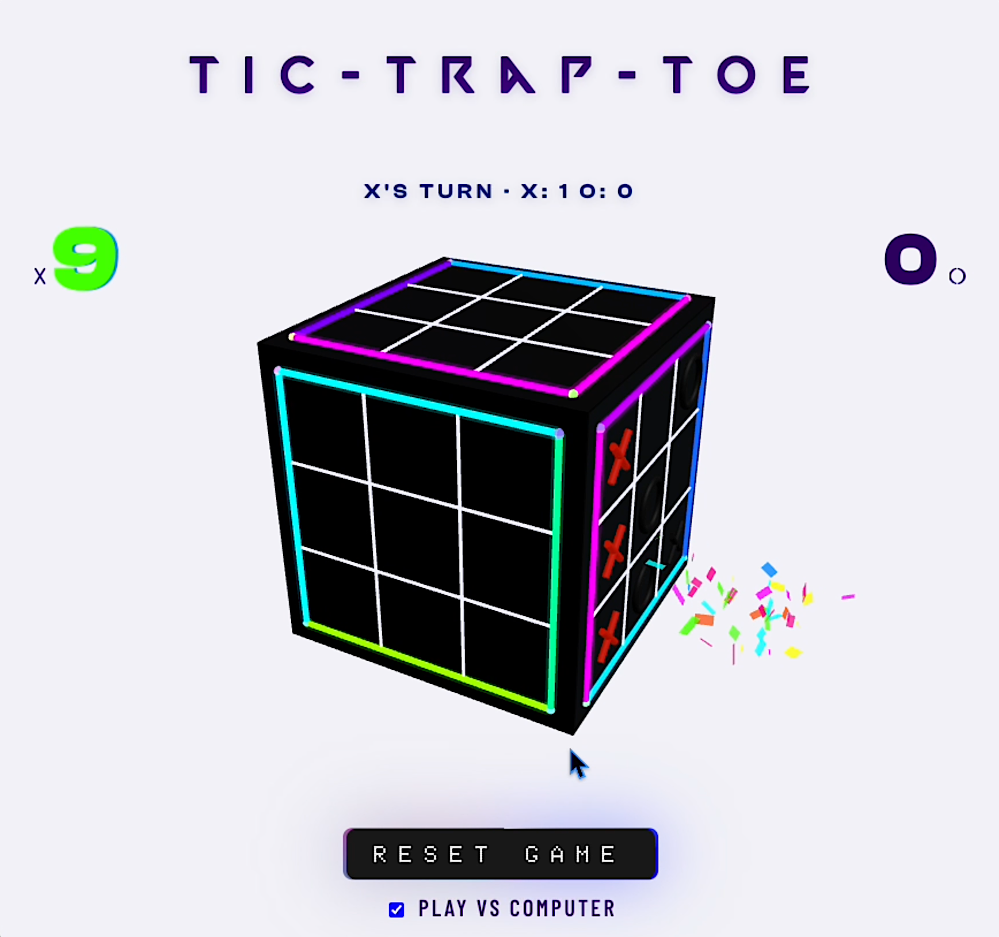
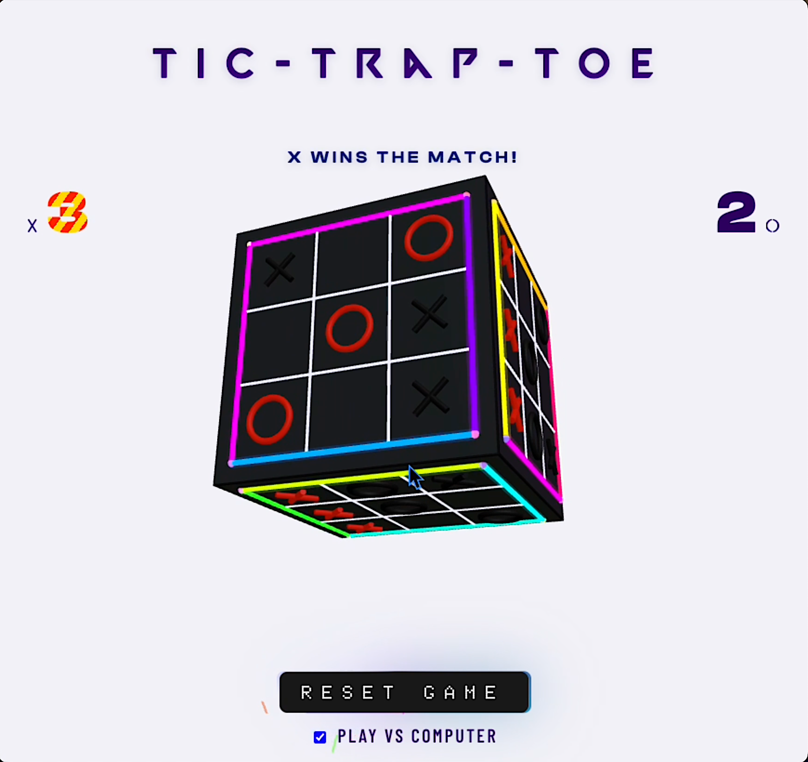

# Tic-Trap-Toe


Six tic-tac-toe boards. One rotating cube. First to win 3 faces wins the match.





---

## Concept

The cube never stops spinning. Faces rotate toward you, become playable, then rotate away. At any moment you may be looking at two or three boards at once — each at a different stage of play. The rotation is the game mechanic, not a gimmick.

**There is no timer. No forced order. If you can see the cells, you can play them.**

---

## How to Play

1. Open `index.html` — no build step required
2. Click any empty cell on a visible face
3. Each face tracks its own X/O turn independently
4. Win a face by getting 3 in a row — **first to 3 faces wins**

**vs Computer** — check the box; the AI plays O on whichever face you just moved on.
**Reset** — clears all six boards and the score.

---

## When a Face Is Won

- Confetti bursts from the winning cell in 3D space
- The face surface turns metallic white — winning marks glow red, losing marks go black
- The score digit scrambles before landing on the new count
- On match win: the score burns yellow-red stripes, the cube decelerates and pulses

---

## Stack

- **Three.js** via importmap CDN — raycasting, geometry, per-frame animation
- Vanilla JS ES modules — `app.js` (pure logic) · `background.js` (all rendering + DOM)
- CSS — conic-gradient button glow, glitch score animation, diagonal-stripe match-win
- Local fonts: Valorant · ClashDisplay · Axion · Barlow Condensed

---

## Run Locally

```bash
open index.html
# or (if browser blocks ES modules from file://)
npx serve .
```
