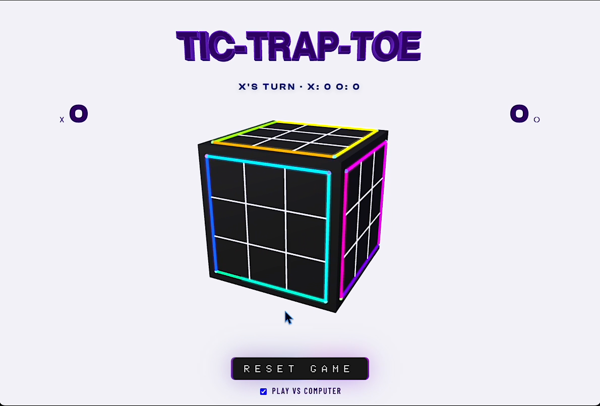
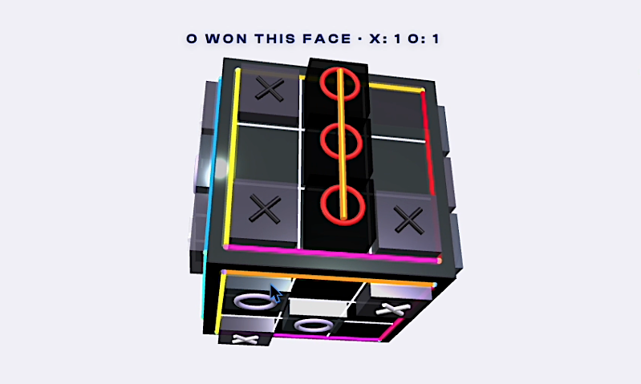
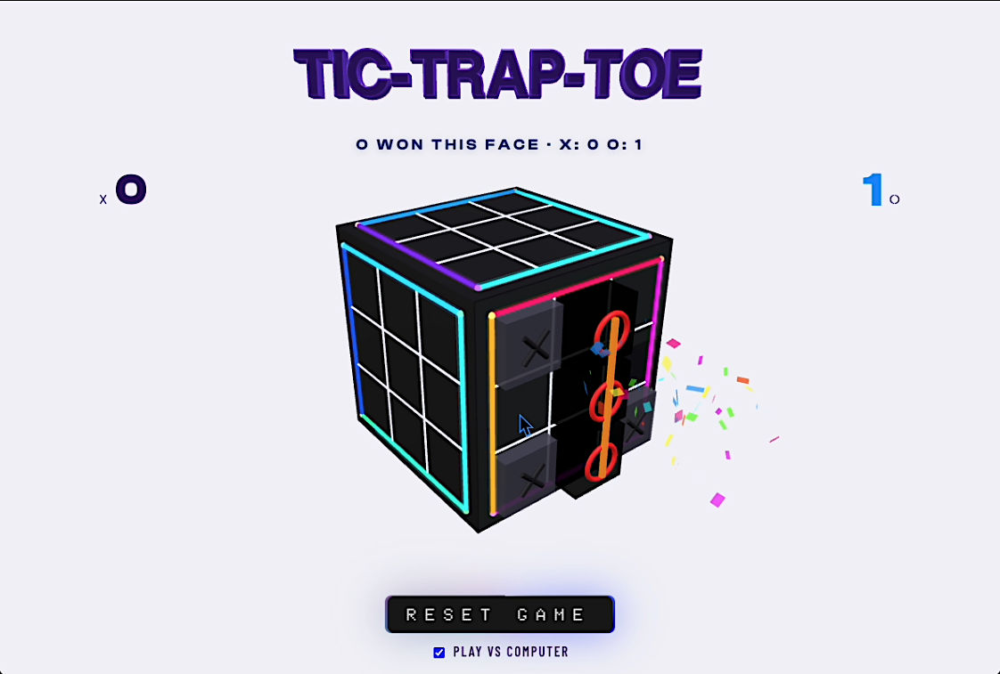
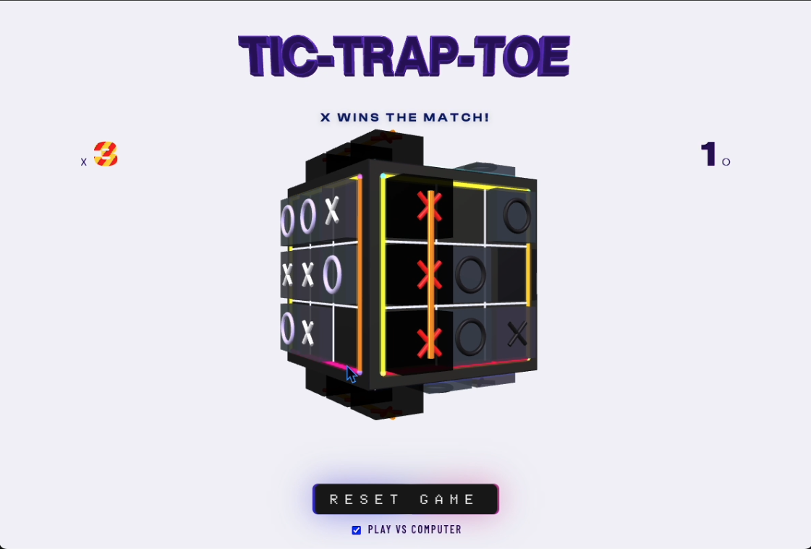

# Tic-Trap-Toe


**Tic-tac-toe is a solved game. This isn't.**

Six boards. One rotating cube. The cube never stops — faces drift toward you, become playable, then spin away. You don't get to pick which game you're in. First to win 3 faces wins the match.



---

## Why it works

Normal tic-tac-toe ends in a draw every time against anyone paying attention. The rotation kills that. You can't stall, you can't force a draw — the board you were about to win might rotate away before your turn comes back. You'll be mid-game on two or three faces at once, each at a different stage, and you have to decide which one is worth committing to.

There's no timer. No forced turn order between faces. **If you can see the cells, you can play them.** The physics enforce the rules.

---

## How to Play

1. Open `index.html` — no build step, just open it
2. Click any empty cell on a face that's rotating toward you
3. Each face has its own independent X/O game
4. Get 3 in a row on a face to win it — **first to 3 faces wins the match**

**vs Computer** — toggle the checkbox; the AI plays O on whatever face you just moved on. Switching modes resets the game.

---

## When a Face Is Won

- A golden bar strikes through the three winning cells
- Confetti bursts from the winning cell in 3D world space
- The face turns metallic white — winning marks glow red, losers go black
- The score scrambles before landing on the new number
- On match win: score burns yellow-red, cube decelerates and pulses twice





---

## Stack

- **Three.js** via importmap CDN — raycasting, `TextGeometry`, per-frame animation
- Vanilla JS ES modules, no build step:
  - `app.js` — pure game logic
  - `cube.js` — all 3-D geometry, marks, slabs, confetti, win visuals
  - `title.js` — extruded 3-D title with foreshortening tilt
  - `audio.js` — fully synthesized Web Audio (zero audio files)
  - `background.js` — scene, camera, input, DOM, tick loop
- CSS — conic-gradient button glow, glitch score animation, diagonal-stripe match-win

---

## Run Locally

```bash
open index.html
# or if your browser blocks ES modules from file://
npx serve .
```
